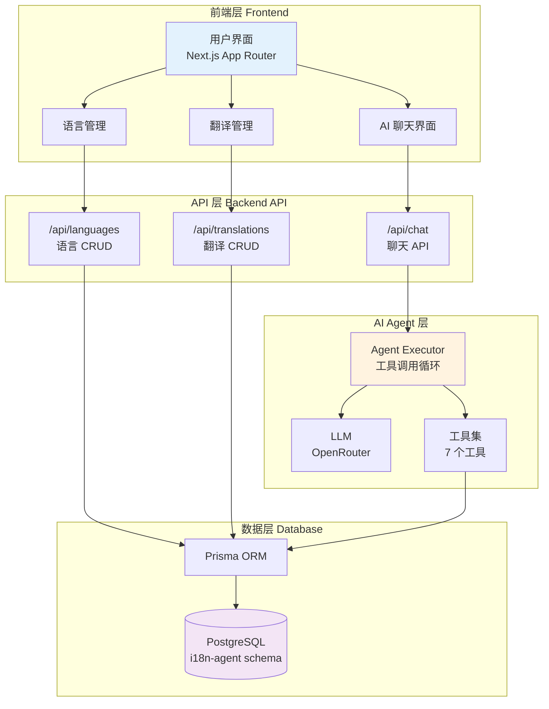
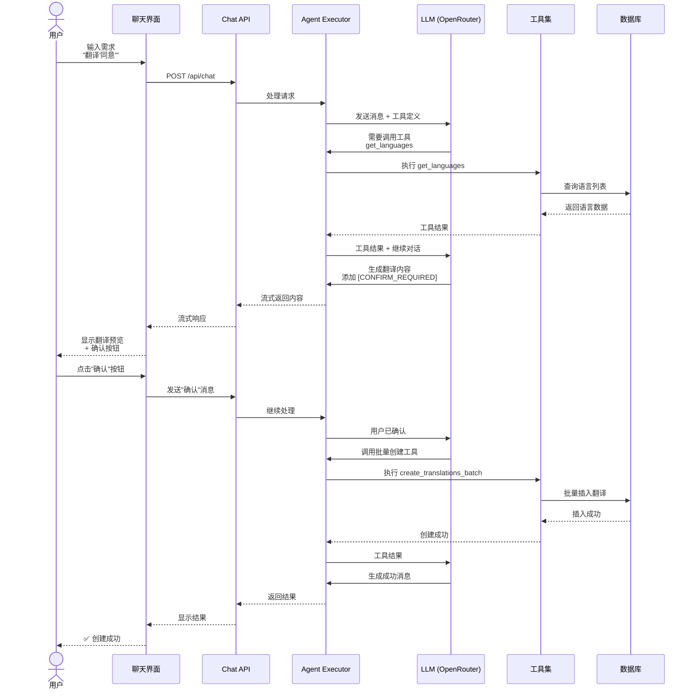
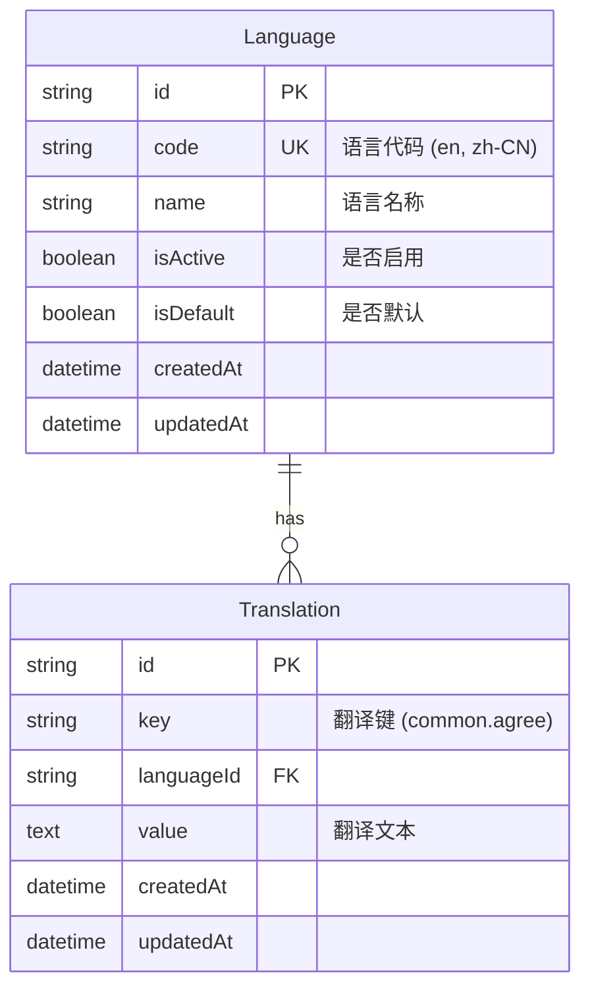
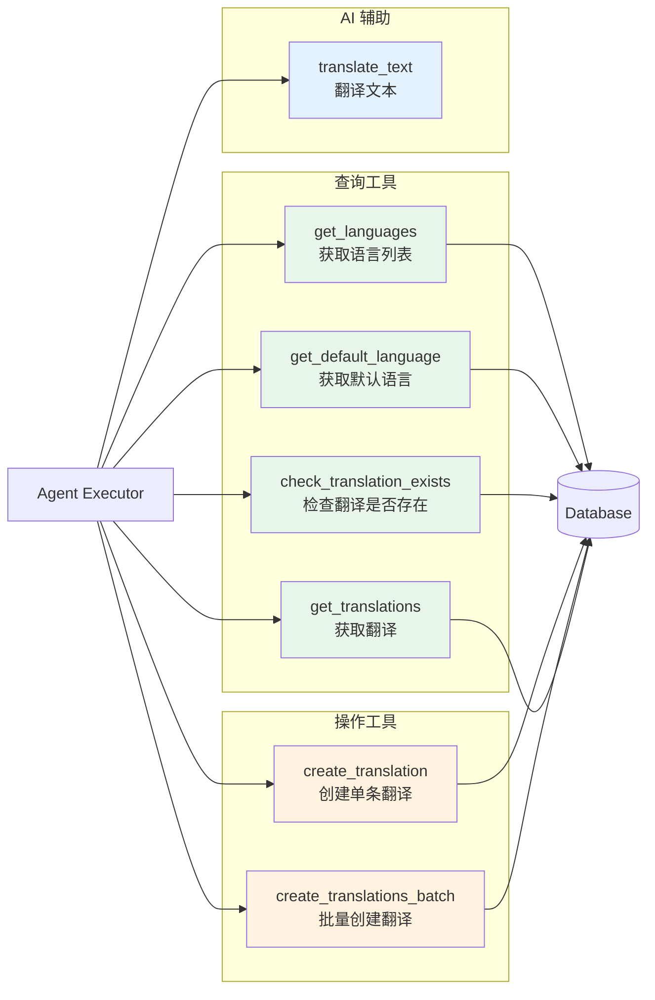

# i18n Agent

AI 驱动的国际化翻译管理系统

## 项目架构

### 整体架构



### AI Agent 工作流程



### 数据模型



### AI 工具集架构



## 技术栈

### 前端

- **Next.js 16** - React 全栈框架（App Router）
- **React 19** - UI 库
- **TypeScript** - 类型安全
- **Tailwind CSS** - 样式框架
- **Shadcn UI** - 组件库
- **Lucide React** - 图标库

### 后端

- **Next.js API Routes** - RESTful API
- **Prisma** - 类型安全的 ORM
- **PostgreSQL** - 关系型数据库

### AI Agent

- **LangChain 1.0** - Agent 框架
- **@langchain/openai** - LLM 集成
- **OpenRouter** - LLM 提供商
- **Tool Calling** - 工具调用能力

### 开发工具

- **ESLint** - 代码检查
- **Prettier** - 代码格式化
- **Husky** - Git hooks
- **lint-staged** - 预提交检查

## 核心特性

### 1. AI 对话式管理

- 🤖 自然语言交互
- 🔄 自动工具调用
- ✅ 操作前确认（按钮式）
- 📊 实时流式响应

### 2. 完整的 CRUD 管理

- 🌍 语言管理（20+ 语言）
- 📝 翻译管理（搜索、筛选、分页）
- 🎯 批量操作

### 3. 智能翻译工作流

```
用户请求 → AI 分析 → 获取语言列表 → 生成翻译
→ 预览确认 → 用户确认 → 批量保存 → 完成反馈
```

### 4. 两步确认机制

- AI 生成翻译后添加 `[CONFIRM_REQUIRED]` 标记
- 前端检测标记，显示确认/取消按钮
- 用户点击按钮触发后续操作
- 防止误操作，确保数据安全

## 项目结构

```
i18n-agent/
├── app/                        # Next.js App Router
│   ├── admin/                  # 管理后台
│   │   ├── layout.tsx         # 统一布局
│   │   ├── page.tsx           # 后台首页
│   │   ├── chat/              # AI 聊天
│   │   │   └── page.tsx
│   │   ├── languages/         # 语言管理
│   │   │   └── page.tsx
│   │   └── translations/      # 翻译管理
│   │       └── page.tsx
│   ├── api/                   # API 路由
│   │   ├── chat/              # AI 聊天 API
│   │   │   └── route.ts
│   │   ├── languages/         # 语言 CRUD
│   │   │   ├── route.ts
│   │   │   └── [id]/route.ts
│   │   └── translations/      # 翻译 CRUD
│   │       ├── route.ts
│   │       └── [id]/route.ts
│   ├── layout.tsx             # 根布局
│   ├── page.tsx               # 首页
│   └── globals.css            # 全局样式
├── lib/                       # 工具库
│   ├── agent/                 # AI Agent
│   │   ├── config.ts         # LLM 配置 + 提示词
│   │   ├── executor.ts       # Agent 执行器
│   │   └── tools.ts          # 工具定义（7 个）
│   ├── prisma.ts             # Prisma Client
│   ├── api-response.ts       # API 响应工具
│   ├── validation.ts         # 数据验证
│   └── utils.ts              # 通用工具
├── components/                # React 组件
│   └── ui/                   # Shadcn UI 组件
├── prisma/                   # Prisma
│   ├── schema.prisma         # 数据模型
│   └── seed.ts               # 种子数据（20 种语言）
├── generated/                # 生成的文件
│   └── prisma/               # Prisma Client
├── .env.local                # 环境变量
├── package.json              # 依赖配置
└── README.md                 # 项目文档
```

## 快速开始

### 1. 安装依赖

```bash
pnpm install
```

### 2. 配置环境变量

创建 `.env.local`：

```bash
# 数据库
DATABASE_URL="postgresql://username@localhost:5432/database?schema=i18n-agent"

# OpenRouter
OPENROUTER_BASE_URL="https://openrouter.ai/api/v1"
OPENROUTER_API_KEY="your-api-key-here"
```

### 3. 初始化数据库

```bash
# 创建数据库和 schema
psql postgres -c "CREATE DATABASE leungwensen;"
psql leungwensen -c "CREATE SCHEMA IF NOT EXISTS \"i18n-agent\";"

# 生成 Prisma Client 并推送 schema
pnpm db:generate
pnpm db:push

# 填充语言种子数据（20 种语言）
pnpm db:seed
```

### 4. 启动开发服务器

```bash
pnpm dev
```

访问：

- 首页：http://localhost:3000
- 管理后台：http://localhost:3000/admin
- AI 助手：http://localhost:3000/admin/chat
- 语言管理：http://localhost:3000/admin/languages
- 翻译管理：http://localhost:3000/admin/translations

## 使用示例

### AI 对话式创建翻译

```
用户: 帮我翻译常用文本"同意"

AI: [自动调用工具获取语言列表...]

准备创建以下翻译：

Key: common.agree

翻译内容：
- English (en): Agree
- 简体中文 (zh-CN): 同意
- 日本語 (ja): 同意する
- 한국어 (ko): 동의
- Français (fr): Accepter
...（共 20 种语言）

请确认是否创建这些翻译？

[显示按钮: ✓ 确认创建  ✗ 取消]

用户: [点击确认按钮]

AI: [调用批量创建工具...]
✅ 已成功创建 20 条翻译记录！
```

## API 文档

### 语言 API

```bash
GET    /api/languages          # 获取所有语言
GET    /api/languages?isActive=true  # 获取启用的语言
POST   /api/languages          # 创建语言
GET    /api/languages/:id      # 获取单个语言
PUT    /api/languages/:id      # 更新语言
DELETE /api/languages/:id      # 删除语言
```

### 翻译 API

```bash
GET    /api/translations       # 获取所有翻译（支持分页）
GET    /api/translations?key=common  # 按 key 搜索
GET    /api/translations?languageId=xxx  # 按语言筛选
POST   /api/translations       # 创建翻译
GET    /api/translations/:id   # 获取单个翻译
PUT    /api/translations/:id   # 更新翻译
DELETE /api/translations/:id   # 删除翻译
```

### AI 聊天 API

```bash
POST   /api/chat               # 发送消息（流式响应）
```

## 开发命令

```bash
pnpm dev          # 启动开发服务器
pnpm build        # 构建生产版本
pnpm start        # 启动生产服务器
pnpm lint         # 运行 ESLint
pnpm lint:fix     # 自动修复 ESLint 错误
pnpm format       # 格式化代码
pnpm type-check   # TypeScript 类型检查
pnpm db:generate  # 生成 Prisma Client
pnpm db:push      # 推送 schema 到数据库
pnpm db:migrate   # 创建数据库迁移
pnpm db:studio    # 打开 Prisma Studio
pnpm db:seed      # 填充种子数据
```

## 环境要求

- Node.js 18+
- pnpm 10+
- PostgreSQL 12+

## License

ISC
